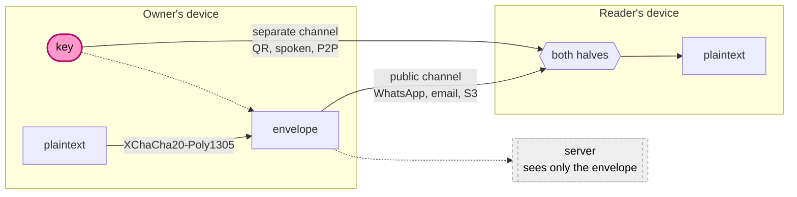
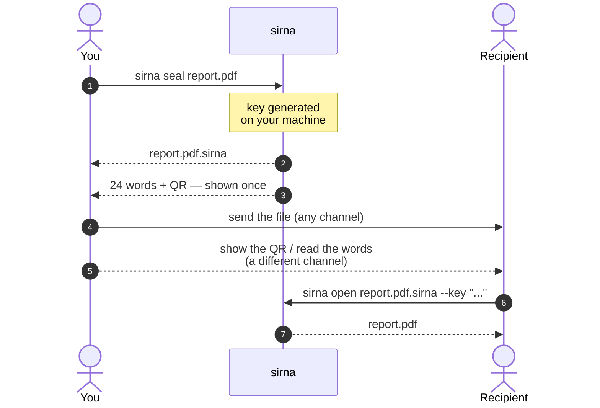
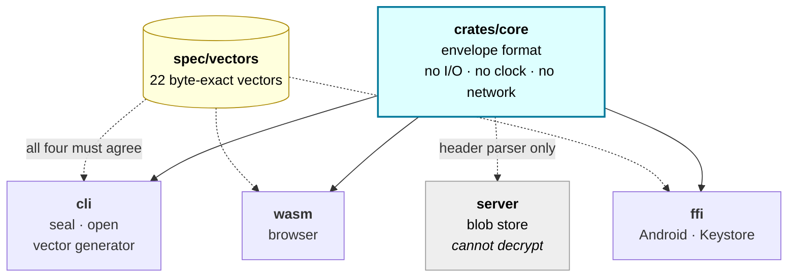
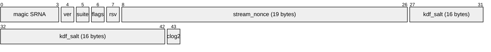

# Sirna

*sirna* — Indonesian: **to vanish without leaving a trace.**

Encrypted messages and files whose **key** can be destroyed on demand. Destroy
the key, and every copy of the ciphertext — anywhere, including copies you do
not control — dies at the same instant.

> **The promise is "destroy the key", not "destroy the copy."**
> You cannot delete data off someone else's device. You *can* delete a key out
> of a hardware secure element, and silicon enforces that.
> → [Threat model](docs/THREAT-MODEL.md)

---

## How it works



The key never touches the server, and never rides in the URL. Leaking one
channel is not enough.

---

## Using it



In a browser, or from a terminal:

```bash
sirna seal report.pdf          # → report.pdf.sirna, prints 24 words once
sirna open report.pdf.sirna --key "legal winner thank ..."
sirna keygen --qr              # QR in the terminal; key never hits a network
sirna inspect report.pdf.sirna # what a stranger can learn: almost nothing
```

→ [Full CLI guide](docs/usage-cli.md)

---

## What a stranger sees

```
$ sirna inspect report.pdf.sirna
format version : 1
chunk size     : 65536 bytes
kind           : file
envelope size  : 104883299 bytes
```

That is everything. Filename, MIME type, true length, expiry and any note are
inside the encrypted metadata block.

---

## Architecture



`core` takes the clock and the RNG as parameters. That is not fastidiousness:
wasm32 has no `SystemTime`, and byte-exact vectors are impossible without a
seedable RNG — and those vectors are the only thing stopping four clients from
silently drifting apart.

`server` links `core` for the header parser only. "The server cannot decrypt" is
a property of the build, not a promise in a README.

---

## Format



Then an encrypted metadata block, then chunks:

```
MetaChunk  u32le len ‖ AEAD(K_meta, …, CBOR{ filename, mime, length, expiry })
DataChunk  AEAD(K_data, nonce_i, aad_i, plaintext_i)     × n

nonce_i = stream_nonce ‖ u32be(i) ‖ last_flag
aad_i   = BLAKE3(header) ‖ u32be(i) ‖ last_flag
```

Folding the header hash into every chunk's AAD authenticates the header without
a separate MAC. Chunk boundaries come from the *authenticated* plaintext length,
never guessed from bytes remaining — which is why a truncated download reports
**truncated** instead of **wrong key**.

→ [Normative spec](spec/ENVELOPE.md)

---

## Errors say what actually happened

| | |
|---|---|
| `wrong key, or the envelope has been altered` | 5 |
| `envelope is incomplete — data is missing from the end` | 6 |
| `unexpected data after the end of the envelope` | 7 |
| `this message has expired` | 9 |
| `key checksum does not match — likely a typo` | 12 |

Codes are identical across every client. Someone with a corrupt download is not
sent hunting for their key.

---

## Status

Live at **[sirna.arisjirat.com](https://sirna.arisjirat.com)**.

| | |
|---|---|
| `spec/ENVELOPE.md` + 22 vectors | ✅ |
| `crates/core` | ✅ |
| `crates/cli` | ✅ |
| `crates/server` — blob store over Garage | ✅ deployed |
| `crates/wasm` + web | ✅ deployed |
| `crates/ffi` + Android — Keystore, shred | ⬜ |

```bash
just check     # doctor + lint + test + spec-lint
```

54 tests. `core` is `#![forbid(unsafe_code)]`.

---

## Successor to OTM

[otm](https://github.com/arisros/otm) keeps a master `SECRET_KEY` on the server,
so the server can decrypt everything it holds. Fine for a teaching demo of
applied cryptography, which is what OTM is and remains — not fine for a tool
that sells the word *secret*, and not patchable, because it is the shape of the
whole design.

## License

MIT
